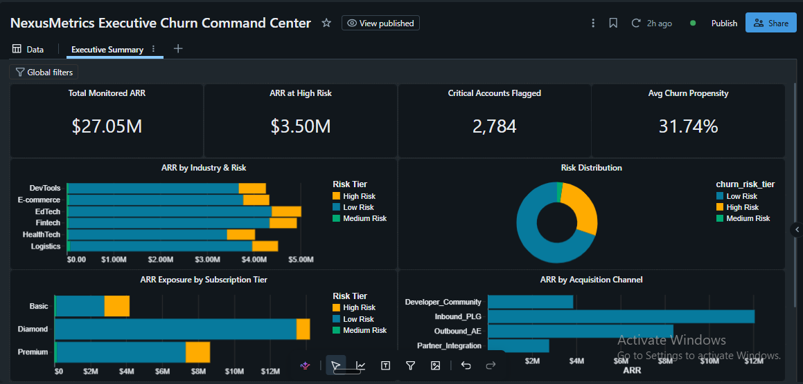

# NexusMetrics: End-to-End Enterprise Customer Churn Intelligence & ML Platform

[](https://databricks.com)
[](https://spark.apache.org)
[](https://mlflow.org)
[](https://delta.io)
[](https://docs.databricks.com/dev-tools/bundles/index.html)
[](https://www.python.org)

---

## Executive Summary & Business Impact

**NexusMetrics** is an enterprise-grade Customer Churn Intelligence and Machine Learning platform engineered on the Databricks Lakehouse platform. Designed specifically for B2B SaaS organizations, the platform shifts Customer Success operations from reactive firefighting to predictive, automated retention intervention.

By uniting distributed feature engineering, XGBoost propensity modeling via MLflow, and declarative Infrastructure as Code (IaC), NexusMetrics provides continuous visibility across critical revenue streams:

| Metric | Value |
|---|---|
| **Total Monitored ARR** | $27.05M across active enterprise customer portfolios |
| **At-Risk ARR Exposure** | $3.50M identified across high-propensity churn segments |
| **Critical Flagged Accounts** | 2,784 organizations targeted for immediate CSM playbooks |
| **Portfolio Mean Churn Propensity** | 31.74% aggregate baseline score, tracked via real-time batch inference |

> **Note on the numbers above:** the portfolio mean (31.74%) sits in the "Low Risk" band, while 2,784 accounts are flagged "Critical" and ~13% of ARR is exposed. This is expected for a right-skewed propensity distribution (most accounts healthy, a smaller tail driving most of the risk) rather than a data error — but if you're presenting this to stakeholders, pair it with the risk-band distribution chart so the skew is visually obvious rather than left to be inferred from two summary numbers.

---

## High-Level Architectural Blueprint

The platform implements a modern Medallion architecture orchestrated through Databricks Asset Bundles (DABs), streaming raw telemetry into governed Unity Catalog tables, scoring via registered MLflow models, and serving insights through native AI/BI Lakeview dashboards.

```text
  [ Source Telemetry & CRM Data ]
                 │
                 ▼
  [ Unity Catalog Medallion Pipeline ]
   ├── Bronze Layer (Raw Ingestion / Delta)
   ├── Silver Layer (Curated Clean & Conformed)
   └── Gold Layer (Star Schema / Fact & Dim)
                 │
                 ▼
  [ MLflow Scored Propensity Model ]
   ├── Distributed XGBoost Batch Inference
   └── Unity Catalog Model Registry
                 │
                 ▼
  [ Databricks SQL Warehouse / Lakeview Executive Dashboard ]
                 ▲
                 │
  [ Automated CI/CD via Databricks Asset Bundles (DABs) & GitHub Actions ]
```

---

## Medallion Data Modeling (Star Schema & Semantic Layer)

Data flows through three distinct tiers enforced under Unity Catalog governance (`nexusmetrics_dev`).

### 1. Table Structures & Primary Keys

**`semantic_views.vw_dim_customers`** — Dimension view containing core firmographics and identifiers.

| Column | Type | Description |
|---|---|---|
| `customer_id` | STRING (PK) | Unique customer identifier |
| `org_id` | STRING | Parent organization identifier |
| `subscription_tier` | STRING | Enterprise / Growth / Starter |
| `acquisition_channel` | STRING | Inbound / Outbound / Partner / Self-serve |
| `industry` | STRING | Firmographic industry vertical |
| `contract_start_date` | DATE | Original contract start date |

**`gold.fct_churn_propensity_scored`** — Fact table capturing behavioral metrics and ML outputs.

| Column | Type | Description |
|---|---|---|
| `customer_id` | STRING (FK) | References `vw_dim_customers.customer_id` |
| `snapshot_date` | DATE | Date of the scoring run |
| `support_ticket_velocity` | DOUBLE | Tickets per rolling 30-day window |
| `avg_response_latency_hrs` | DOUBLE | Mean support response time, hours |
| `arr_amount` | DECIMAL(18,2) | Annual recurring revenue for the account |
| `churn_propensity_score` | DOUBLE | Model output, 0.0–1.0 |
| `risk_band` | STRING | Derived: `HIGH` / `MEDIUM` / `LOW` |

### 2. Analytical Joins & Risk Classification Thresholds

Propensity scores generated by the inference pipeline map organizations into standardized operational risk tiers:

| Risk Band | Score Range | Action |
|---|---|---|
| **High Risk** | ≥ 0.70 | Immediate automated alert routing to enterprise CSM workflows and executive retention queues |
| **Medium Risk** | 0.40 – 0.69 | Monitored via automated health-score tracking and secondary engagement campaigns |
| **Low Risk** | < 0.40 | Standard automated nurturing and quarterly business review tracking |

---

## Infrastructure as Code (IaC) & CI/CD Pipeline

NexusMetrics abandons manual workspace configurations in favor of declarative infrastructure management using Databricks Asset Bundles (DABs) (`databricks.yml`).

- **Multi-Environment Isolation** — clear separation between `dev` and `prod` targets, ensuring strict environment parity across Unity Catalog catalogs, schemas, jobs, and serverless compute pools.
- **Declarative Orchestration** — workflow pipelines, multi-task jobs, and dashboard resources are defined directly in version-controlled configuration files.
- **Automated CI/CD Workflows** — GitHub Actions pipelines automatically trigger `databricks bundle validate` on pull request creation and execute `databricks bundle deploy` upon merges to `main`.

---

## Executive Churn Command Center (BI & Presentation Layer)

The presentation layer utilizes a native Databricks AI/BI Lakeview Executive Dashboard, configured to fit cleanly into a single-screen 1080p viewport without vertical scrolling.



**Dashboard Visual Hierarchy:**

- **Top KPI Row (4 Counter Cards):** Total Monitored ARR ($27.05M), ARR at High Risk ($3.50M), Critical Accounts Flagged (2,784), and Average Churn Propensity (31.74%) — styled with vertical label stacking and precise compact currency/percentage formatting.
- **2x2 Analytical Grid:**
  - **ARR by Industry & Risk** — horizontal stacked bar chart mapping industry verticals against aggregated ARR segmented by churn risk tier.
  - **Portfolio Risk Distribution** — visual breakdown of accounts across risk bands.
  - **ARR Exposure by Subscription Tier** — horizontal stacked distribution illustrating tier-specific financial exposure.
  - **ARR by Acquisition Channel** — clean categorical breakdown of revenue acquisition vectors.

---

## Repository File Structure

```plaintext
saas-lakehouse-medallion-dabs-cicd/
├── .github/
│   └── workflows/
│       └── deploy.yml          # GitHub Actions CI/CD pipeline for DABs
├── bundles/
│   └── bundle_config.yml       # Asset bundle resource definitions
├── notebooks/
│   ├── 01_bronze_ingest.py     # Raw data ingestion notebooks
│   ├── 02_silver_transform.py  # Cleansed conformed transformations
│   └── 03_gold_ml_score.py     # MLflow batch inference & scoring
├── sql/
│   └── semantic_views.sql      # Star schema & dimension view definitions
├── dashboards/
│   └── executive_summary.lvdash.json  # Lakeview dashboard definition
├── assets/
│   └── dashboard_executive_summary.png
├── databricks.yml              # Root Databricks Asset Bundle configuration
└── README.md
```

---

## Local Setup, Deployment & Execution Guide

### Prerequisites

- Databricks CLI installed locally.
- Active Databricks workspace with Unity Catalog enabled.

### 1. Authenticate with Databricks

```bash
databricks auth login --host <your-databricks-workspace-url>
```

### 2. Validate the Asset Bundle

Verify the declarative configuration syntax and dependency graph locally:

```bash
databricks bundle validate -t dev
```

### 3. Deploy to the Development Environment

Provision all jobs, pipelines, and dashboard resources to your workspace:

```bash
databricks bundle deploy -t dev
```

### 4. Run the End-to-End Pipeline & Access Dashboard

Trigger the Medallion ETL and ML scoring workflow via the CLI or Databricks UI:

```bash
databricks bundle run nexusmetrics_pipeline -t dev
```

Navigate to your Databricks workspace UI, open the **AI/BI Lakeview** tab, and access the **Executive Summary** dashboard to view real-time churn intelligence.
